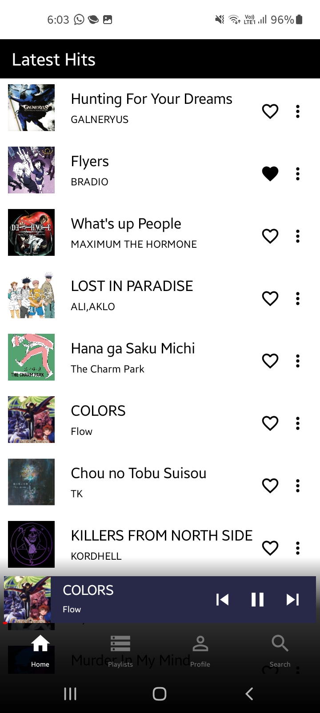
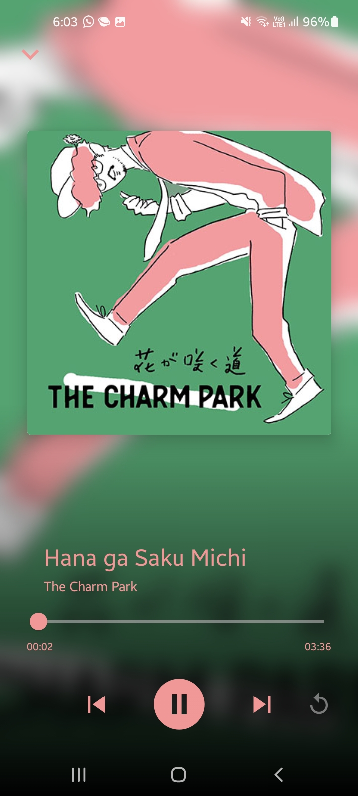
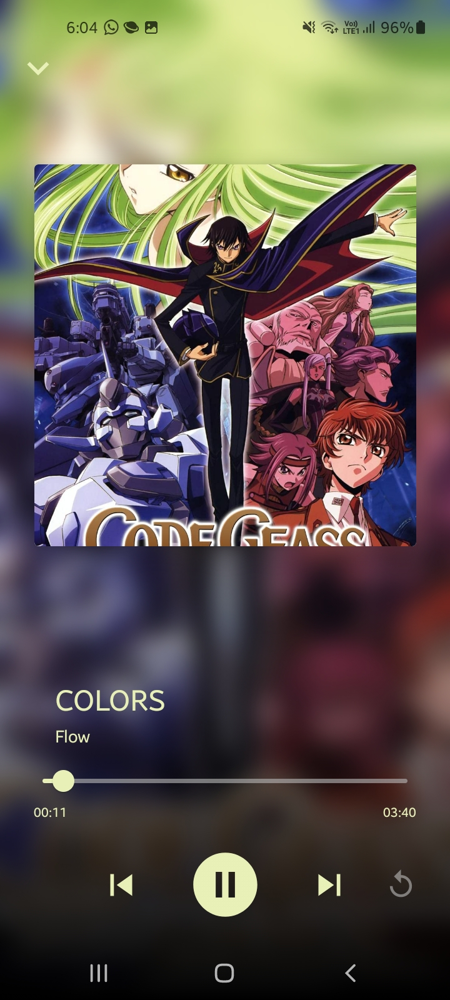
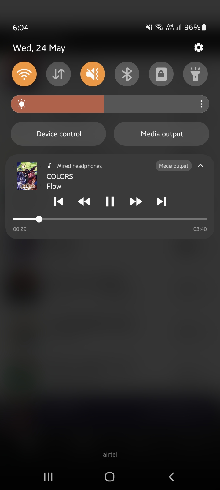
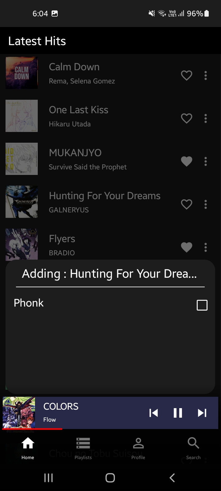
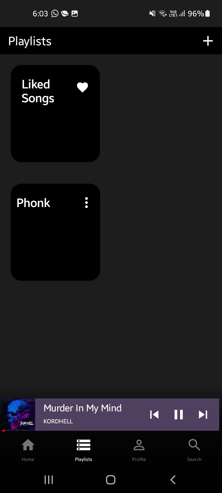

# music-streaming-app
A music streaming application written in kotlin and jetpack compose offering dynamic theming and clean UI

### Dark/Light Mode and Notification
|        |        |          |                                                                      |
|------------------------------------|:-----------------------------------:|:-----------------------------------:|:-----------------------------------------------------------------------------------------------:|
|          |     |          |  |

## Features
- Jetpack Compose UI. Custom animations, transitions, light/dark theme and layouts.
- custom Jetpack compose Navigation and Components
- MVI Clean Architecture
- Dependency injection with Hilt
- Firebase database for songs metadata
- In-App Song sharing via online links that open directly to application
- 320kbps Highest audio quality songs on server
- Media style Notification
- Easy swipe animations for browsing through songs
- Playlists creation features
- Easy search songs by title or artist name

